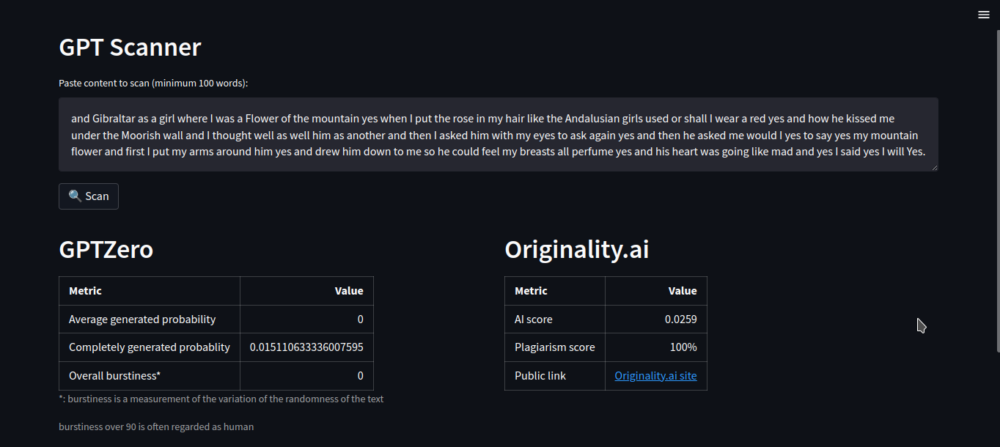

<!-- Improved compatibility of back to top link: See: https://github.com/othneildrew/Best-README-Template/pull/73 -->
<a name="readme-top"></a>
<!--
*** Thanks for checking out the Best-README-Template. If you have a suggestion
*** that would make this better, please fork the repo and create a pull request
*** or simply open an issue with the tag "enhancement".
*** Don't forget to give the project a star!
*** Thanks again! Now go create something AMAZING! :D
-->


<!-- PROJECT SHIELDS -->
<!--
*** I'm using markdown "reference style" links for readability.
*** Reference links are enclosed in brackets [ ] instead of parentheses ( ).
*** See the bottom of this document for the declaration of the reference variables
*** for contributors-url, forks-url, etc. This is an optional, concise syntax you may use.
*** https://www.markdownguide.org/basic-syntax/#reference-style-links
-->
[![Contributors][contributors-shield]][contributors-url]
[![Forks][forks-shield]][forks-url]
[![Stargazers][stars-shield]][stars-url]
[![Issues][issues-shield]][issues-url]
[![GPLv3 License][license-shield]][license-url]


<!-- PROJECT LOGO -->
<br />
<div align="center">

<h3 align="center">GPT-Scanner</h3>

  <p align="center">
  Detect AI and plagiarism with the help of some popular APIs
    <br />
    <a href="https://github.com/Capital2/GPT-Scanner"><strong>Explore the docs »</strong></a>
    <br />
    <br />
    <a href="https://github.com/Capital2/GPT-Scanner/issues">Report Bug</a>
    ·
    <a href="https://github.com/Capital2/GPT-Scanner/issues">Request Feature</a>
  </p>
</div>

<!-- ABOUT THE PROJECT -->
## About The Project

APIs such as [GPTZero](https://gptzero.me/) and [Originality.ai](https://app.originality.ai/) are open for you to try them out.

### Note:
This repository is not associated with or endorsed by providers of the APIs contained in this GitHub repository. This project is intended for educational purposes only.

### Dependencies

*   version 3.10


<!-- GETTING STARTED -->
## Getting Started

1. Clone the repo
   ```sh
   git clone https://github.com/Capital2/GPT-Scanner.git
   ```
2. Make venv and install dependencies
   ```sh
   cd GPT-Scanner/
   mkdir data/ # used to store accounts
   python3 -m venv .venv
   source .venv/bin/activate
   pip install -r requirements.txt
   ```
3. Run
   ```sh
   streamlit run streamlit_app.py
   ```
## Docker
After cloning the repo:

1. Build the image
`docker build -t gpt-scanner .`

2. run the container
`docker run -v gpt-scanner-data:/app/data -dp 0.0.0.0:8501:8501 --name gpt-scanner-prod gpt-scanner`

<!-- CONTRIBUTING -->
## Contributing

Contributions are what make the open source community such an amazing place to learn, inspire, and create. Any contributions you make are **greatly appreciated**.

If you have a suggestion that would make this better, please fork the repo and create a pull request. You can also simply open an issue with the tag "enhancement".
Don't forget to give the project a star! Thanks again!

1. Fork the Project
2. Create your Feature Branch (`git checkout -b feature/AmazingFeature`)
3. Commit your Changes (`git commit -m 'Add some AmazingFeature'`)
4. Push to the Branch (`git push origin feature/AmazingFeature`)
5. Open a Pull Request

<!-- LICENSE -->
## License

Distributed under the GNU/GPLv3 Licence. See `LICENSE` for more information.


<!-- ACKNOWLEDGMENTS -->
## Acknowledgments

* [Othneildrew](https://github.com/othneildrew/Best-README-Template)
* [AWesome Badges](https://github.com/Ileriayo/markdown-badges)
<p align="right">(<a href="#readme-top">back to top</a>)</p>

<!-- MARKDOWN LINKS & IMAGES -->
<!-- https://www.markdownguide.org/basic-syntax/#reference-style-links -->
[contributors-shield]: https://img.shields.io/github/contributors/Capital2/GPT-Scanner.svg?style=for-the-badge
[contributors-url]: https://github.com/Capital2/GPT-Scanner/graphs/contributors
[forks-shield]: https://img.shields.io/github/forks/Capital2/GPT-Scanner.svg?style=for-the-badge
[forks-url]: https://github.com/Capital2/GPT-Scanner/network/members
[stars-shield]: https://img.shields.io/github/stars/Capital2/GPT-Scanner.svg?style=for-the-badge
[stars-url]: https://github.com/Capital2/GPT-Scanner/stargazers
[issues-shield]: https://img.shields.io/github/issues/Capital2/GPT-Scanner.svg?style=for-the-badge
[issues-url]: https://github.com/Capital2/GPT-Scanner/issues
[license-shield]: https://img.shields.io/github/license/Capital2/GPT-Scanner.svg?style=for-the-badge
[license-url]: https://github.com/Capital2/GPT-Scanner/blob/master/LICENSE.txt
[linkedin-shield]: https://img.shields.io/badge/-LinkedIn-black.svg?style=for-the-badge&logo=linkedin&colorB=555
[linkedin-url]: https://linkedin.com/in/linkedin_username
[product-screenshot]: images/screenshot.png
[Next.js]: https://img.shields.io/badge/next.js-000000?style=for-the-badge&logo=nextdotjs&logoColor=white
[Next-url]: https://nextjs.org/
[React.js]: https://img.shields.io/badge/React-20232A?style=for-the-badge&logo=react&logoColor=61DAFB
[React-url]: https://reactjs.org/
[Vue.js]: https://img.shields.io/badge/Vue.js-35495E?style=for-the-badge&logo=vuedotjs&logoColor=4FC08D
[Vue-url]: https://vuejs.org/
[Angular.io]: https://img.shields.io/badge/Angular-DD0031?style=for-the-badge&logo=angular&logoColor=white
[Angular-url]: https://angular.io/
[Svelte.dev]: https://img.shields.io/badge/Svelte-4A4A55?style=for-the-badge&logo=svelte&logoColor=FF3E00
[Svelte-url]: https://svelte.dev/
[Laravel.com]: https://img.shields.io/badge/Laravel-FF2D20?style=for-the-badge&logo=laravel&logoColor=white
[Laravel-url]: https://laravel.com
[Bootstrap.com]: https://img.shields.io/badge/Bootstrap-563D7C?style=for-the-badge&logo=bootstrap&logoColor=white
[Bootstrap-url]: https://getbootstrap.com
[JQuery.com]: https://img.shields.io/badge/jQuery-0769AD?style=for-the-badge&logo=jquery&logoColor=white
[JQuery-url]: https://jquery.com 
[FastAPI.py]: https://img.shields.io/badge/FastAPI-005571?style=for-the-badge&logo=fastapi
[FastAPI-url]:https://fastapi.tiangolo.com/
